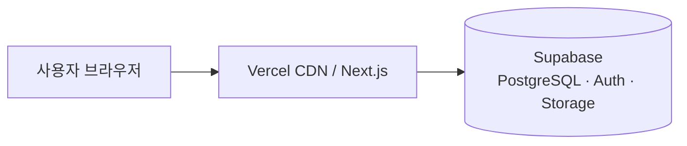

# 시스템 아키텍처 · 초기 세팅

과일 주문(택배·픽업·공구 등) 확장을 염두에 둔 **Next.js 풀스택 + Supabase** 구성이다.

## 아키텍처 개요



| 구분 | 역할 |
|------|------|
| **Next.js (App Router)** | UI, Server Actions / Route Handler, 미들웨어(세션 갱신) |
| **Vercel** | 호스팅·빌드·환경 변수 |
| **Supabase** | PostgreSQL, 인증, 스토리지(이미지 등) |

### 주요 경로

- `app/` — 페이지·레이아웃
- `lib/supabase/client.ts` — 클라이언트 컴포넌트용 Supabase
- `lib/supabase/server.ts` — 서버(서버 컴포넌트·액션)용 Supabase
- `middleware.ts` — Auth 쿠키 갱신

### 환경 변수

로컬은 **`c:\Project\web\.env.local`** (Git에 올리지 않음).  
예시 이름은 **`.env.example`** 참고.

| 변수 | 설명 |
|------|------|
| `SUPABASE_URL` | Supabase Project URL |
| `SUPABASE_ANON_KEY` | Publishable 또는 anon public 키 |

`next.config.ts`에서 위 값을 `NEXT_PUBLIC_*`로 넘겨 브라우저 번들과 맞춘다.

---

## 초기 세팅 (처음 한 번)

1. **Node.js** 설치 (LTS 권장)
2. 저장소 클론 후 프로젝트 폴더로 이동
3. 의존성 설치  
4. `.env.example`을 복사해 `.env.local` 만들고 `SUPABASE_*` 채우기  
5. 개발 서버 실행

---

## 명령어 정리

프로젝트 루트(`web`)에서 실행한다.

```bash
# 의존성 설치
npm install

# 개발 서버 (http://localhost:3000)
npm run dev

# 프로덕션 빌드
npm run build

# 빌드 결과 로컬 실행
npm run start

# ESLint
npm run lint
```

### Git

```bash
git status
git add .
git commit -m "메시지"
git push origin main
```

### Vercel 배포

1. [Vercel](https://vercel.com)에서 GitHub 저장소 연결  
2. **Settings → Environment Variables**에 `SUPABASE_URL`, `SUPABASE_ANON_KEY` 등록 (Production / Preview 필요 시 동일)  
3. 재배포

---

## 참고 링크

- [Next.js 문서](https://nextjs.org/docs)
- [Supabase 문서](https://supabase.com/docs)
- [Vercel 문서](https://vercel.com/docs)
